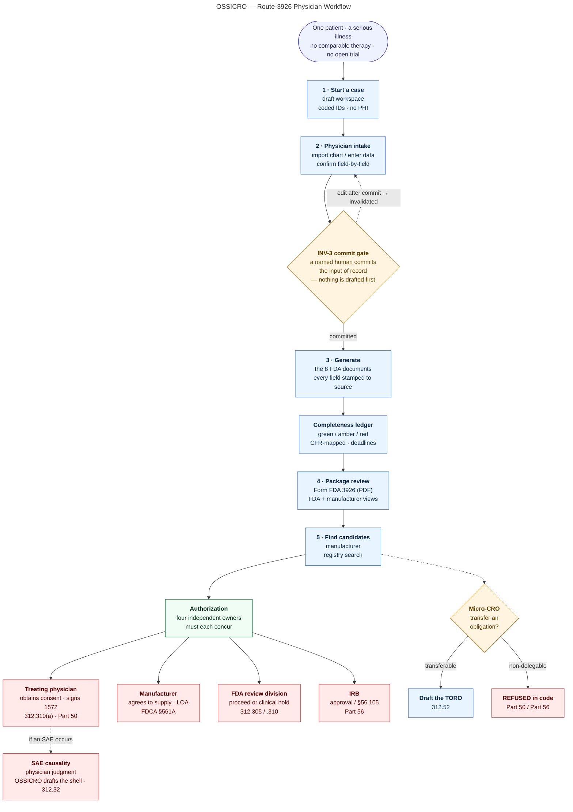

# OSSICRO — the physician's workflow (Route-3926, single-patient expanded access)

*One page, for teaching and presentation.* Blue = **OSSICRO drafts, computes, and assembles.**
Amber = a **hard gate** where a named human must commit. Red = a **non-delegable human
act OSSICRO refuses to perform, in code.** The software drafts everything and decides nothing.

**The teaching point.** The physician moves top-to-bottom through a workspace that turns a
patient's chart into a complete, cited FDA package in minutes instead of months. But at every
point where the law requires *human* judgment — committing the data of record, obtaining
consent, IRB approval, causality, signing, submitting — OSSICRO **stops and hands the pen to a
named person.** The four authorization owners are independent by design; no single party, and
never the software, can grant the whole thing. That boundary is not a policy document — it is
enforced in the engine, which is why the micro-CRO layer will *refuse* to draft a transfer of a
non-delegable obligation.

> A polished, self-contained HTML version of this diagram (theme-aware, for slides) can be
> regenerated from this source; see the submission materials.
