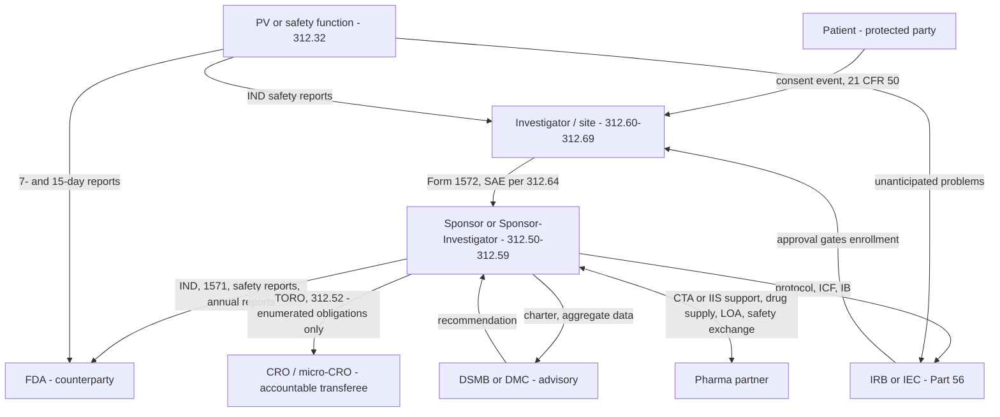

# Entity Map — The Six Coordinating Entities and Their Legal Relationships

> [!authority] Governing authority
> 21 CFR 312.3(b) (role definitions), 312.50–312.70 (sponsor/investigator duties, CRO transfer at §312.52, investigator disqualification at §312.70), 21 CFR Part 56 and 45 CFR 46 (IRB), 21 CFR 312.32 and ICH E2A (safety), FDA DMC guidance (2006 final; 2024 draft). Status: **Mixed** — the entity roles and instruments are confirmed; the micro-CRO layer and the collapse analysis are OSSICRO positions, marked inline.

An IND-era trial is coordinated by six entities, each with a distinct legal basis, a distinct set of judgments only it may make, and a distinct enforcement exposure. Everything OSSICRO generates is a message between these entities — a form one signs for another, a report one owes another, an approval one grants another. This page maps who signs, who judges, and who FDA can act against, and identifies the two counterparties (FDA, the pharma partner) and the one protected party (the patient) that sit around the six.

## 1. The six entities

### 1. Sponsor
The person that takes responsibility for and initiates the investigation (21 CFR 312.3(b)). Holds the IND and the direct FDA relationship; duties enumerated at [21 CFR 312.50–312.59](https://www.law.cornell.edu/cfr/text/21/312.50): select qualified investigators (§312.53), inform them (§312.55), monitor (§312.56), keep records (§312.57), report safety findings (§312.32), and report annually (§312.33). Accountability is retained even when duties are delegated (ICH E6(R3) §3, service-provider oversight). Page: [[sponsor]].

### 2. Investigator
The individual under whose immediate direction the drug is administered or dispensed (21 CFR 312.3(b)); duties at §§312.60–312.69: protocol adherence, drug control (§312.61–312.62), consent (§312.60/Part 50), IRB assurance (§312.66), records (§312.62), safety reporting to the sponsor (§312.64). Personally exposed: FDA may disqualify a non-compliant investigator (§312.70). Page: [[investigator]]. In OSSICRO's core case the sponsor and investigator are **one individual** — the [[sponsor-investigator]] (21 CFR 312.3(b)) — and every sponsor↔investigator document flow collapses into a self-directed obligation plus the outward flows to FDA and the IRB. The obligations do not disappear; only the arrows shorten.

### 3. CRO — and OSSICRO's micro-CRO
An entity that assumes enumerated sponsor obligations in a signed writing ([21 CFR 312.52](https://www.law.cornell.edu/cfr/text/21/312.52)). Two confirmed consequences structure the whole system: an obligation not described in the writing is **not transferred** (§312.52(a)), and an assuming CRO becomes "subject to the same regulatory action as a sponsor" (§312.52(b)) — so the transferee must be a legally accountable entity. Software cannot be enforced against and therefore cannot be a transferee; this is the load-bearing argument at [[legal-thesis-3123-vs-31252]]. Pages: [[cro]], [[transfer-of-regulatory-obligations-toro]].

> [!interpretive] OSSICRO position
> The **micro-CRO** ([[micro-cro-accountable-layer]]) is OSSICRO's thin, named, human-staffed entity that assumes — via TORO — only the sponsor obligations that legally require an accountable transferee when the sponsor-investigator cannot personally hold them. It never assumes investigator conduct obligations (those are personal and non-transferable) and never owns consent, IRB judgment, or causality. The micro-CRO is a design response to §312.52, not a category FDA recognizes by that name.

### 4. IRB / IEC
The formally designated ethics board (21 CFR 56.102(g); 45 CFR 46) that must review and approve the research before initiation (§56.103; §312.66) and conduct continuing review (§56.108–56.109). It applies the approval criteria of [21 CFR 56.111](https://www.ecfr.gov/current/title-21/chapter-I/subchapter-A/part-56/subpart-C/section-56.111): risks minimized and reasonable in relation to benefits, equitable selection, adequate consent, data-safety monitoring where appropriate, privacy protections. FDA can act against a non-compliant IRB (§§56.120–56.124). For multi-site federally funded work a single IRB of record is mandated (45 CFR 46.114(b)); see [[single-irb-mandate-and-central-irbs]]. Page: [[irb-iec]].

### 5. DSMB / DMC
An independent, conflict-free expert committee that reviews accumulating safety (and sometimes efficacy) data and issues **recommendations** — continue, modify, stop — to the sponsor. It is advisory, not decisional: the sponsor owns the response. Required by regulation only for exception-from-informed-consent emergency research (21 CFR 50.24(a)(7)(iv)); otherwise the 2006 FDA guidance (and the 2024 draft that would supersede it) governs when one is warranted and how it operates under a written [[dsmb-charter]]. An independent-statistician firewall keeps unblinded interim data away from the sponsor. Pages: [[dsmb-dmc]], [[dsmb-workflow]].

### 6. Pharmacovigilance / safety function
The safety apparatus discharging 21 CFR 312.32: intake, coding, narrative writing, timeline tracking, and expedited-report assembly (Form 3500A per ICH E2A/E2B(R3)). The function is organizationally a sponsor duty rather than a free-standing legal person — but it coordinates as an entity because its outputs flow to every other party: FDA (7-/15-day reports), all investigators (§312.32(c)(1)), the IRB (unanticipated problems, §56.108(b)), and the DSMB (aggregate data). The seriousness/expectedness/**causality** determinations that trigger the clocks belong to a qualified physician — the [[medical-monitor]]. Pages: [[pharmacovigilance-safety]], [[safety-reporting-workflow]].

## 2. Counterparties and the protected party

- **FDA** — regulator, not coordinator: receives the IND, runs the 30-day clock (§312.40), can impose clinical hold (§312.42), inspects sponsors (§312.58) and sites (BIMO), and disqualifies investigators (§312.70). Page: [[fda-as-counterparty]].
- **Pharma partner** — sponsor in Mode A; supplier/funder in Mode B (IIS, via Medical Affairs at FMV) or expanded access (drug supply + letter of authorization). Never OSSICRO's transferee. Pages: [[pharma-partner-sponsor]], [[pharma-partner-interface-iis]].
- **Patient / participant** — owns no regulated function but is the party the entire structure protects; rights attach through Part 50 consent, Part 56 review, and HIPAA. Page: [[patient]].

## 3. Who signs, who judges, who is enforceable

| Entity | Legal basis | Signs | Judges (non-delegable core) | FDA enforcement exposure |
|---|---|---|---|---|
| [[sponsor]] | 312.50–312.59 | Form 1571; TORO; IND submissions | Investigator selection; unreasonable-risk discontinuation (§312.56(d), ≤5 working days); safety-report release | Clinical hold; IND termination (§312.44); inspection (§312.58) |
| [[investigator]] | 312.60–312.69 | Form 1572; delegation log | Eligibility; consent adequacy; SAE reporting to sponsor (§312.64) | Disqualification (§312.70); BIMO findings |
| [[cro|CRO / micro-CRO]] | 312.52 | TORO (countersignature) | Only obligations enumerated in the writing | "Same regulatory action as a sponsor" (§312.52(b)) |
| [[irb-iec]] | Part 56; 45 CFR 46 | Approval/continuing-review determinations | §56.111 approval criteria | Administrative actions, disqualification (§§56.120–56.124) |
| [[dsmb-dmc]] | FDA DMC guidance; 50.24(a)(7)(iv) | Charter; meeting minutes and recommendations | Continue/modify/stop **recommendation** | None direct — advisory; accountability stays with the sponsor |
| [[pharmacovigilance-safety|PV / safety]] | 312.32; ICH E2A | 3500A preparation (physician owns the assessment) | Seriousness / expectedness / causality ([[medical-monitor]]) | Via the sponsor's exposure |

## 4. The relationship diagram

In Mode B the SP and INV boxes are the same person; the 1572/1571/SAE arrows become self-directed obligations that still must be documented in the [[document-catalog|TMF]]. The full arrow catalog with document names and timing lives at [[inter-entity-document-flow-map]].

## 5. The institutional mirror

Academic medical centers already run this map as a three-way internal split: a **regulatory-affairs office** (sponsor-side obligations: IND, forms, FDA correspondence), an **IRB/ethics office** (Part 56/46 review), and a **clinical trials office / protocol operations** (site conduct, budgets, monitoring). OSSICRO reproduces that separation for a physician who has no institution behind them: the engine plays regulatory-affairs *clerk* (never signatory), the [[irb-iec|external IRB]] plays the ethics office, and the [[micro-cro-accountable-layer|micro-CRO]] backstops the operations functions that need an accountable entity. *(Interpretive — the mapping is an OSSICRO design analogy, not a regulatory structure.)*

> [!warning] Non-delegable
> Each entity has a judgment core no other party — and no software — may hold: the sponsor's risk-discontinuation and safety-report accountability (21 CFR 312.32, 312.56(d)); the investigator's consent and eligibility judgments (21 CFR 50.20, 312.60); the IRB's approval determination (21 CFR 56.111); the DSMB's independent recommendation (FDA DMC guidance); the medical monitor's causality call (21 CFR 312.32(a)); and the 312.52 requirement that any transferee of sponsor obligations be a legally accountable entity. OSSICRO drafts, checks, routes, and times the traffic between entities; it is never one of them. See [[non-delegable-functions-and-gates]].

## Related

- [[what-is-ossicro]]
- [[glossary]]
- [[regulatory-landscape]]
- [[legal-thesis-3123-vs-31252]]
- [[the-three-pathways-triage]]
- [[sponsor]] · [[investigator]] · [[sponsor-investigator]] · [[cro]] · [[micro-cro-accountable-layer]] · [[irb-iec]] · [[dsmb-dmc]] · [[pharmacovigilance-safety]] · [[medical-monitor]]
- [[pharma-partner-sponsor]] · [[fda-as-counterparty]] · [[patient]]
- [[inter-entity-document-flow-map]]
- [[transfer-of-regulatory-obligations-toro]]
- [[non-delegable-functions-and-gates]]
- [[two-modes-site-vs-sponsor-investigator]]

## Sources

- [eCFR — 21 CFR Part 312 (definitions §312.3; Subpart D responsibilities §§312.50–312.70)](https://www.ecfr.gov/current/title-21/chapter-I/subchapter-D/part-312)
- [21 CFR 312.52 — Transfer of obligations to a contract research organization (Cornell LII)](https://www.law.cornell.edu/cfr/text/21/312.52)
- [21 CFR 312.32 — IND safety reporting](https://www.ecfr.gov/current/title-21/chapter-I/subchapter-D/part-312/subpart-B/section-312.32)
- [eCFR — 21 CFR Part 56 (IRBs), incl. §56.111 approval criteria](https://www.ecfr.gov/current/title-21/chapter-I/subchapter-A/part-56)
- [eCFR — 45 CFR Part 46, incl. §46.114 single-IRB mandate](https://www.ecfr.gov/current/title-45/subtitle-A/subchapter-A/part-46)
- [FDA — Use of Data Monitoring Committees in Clinical Trials (draft, 2024; would supersede 2006 final)](https://www.fda.gov/regulatory-information/search-fda-guidance-documents/use-data-monitoring-committees-clinical-trials)
- [ICH E6(R3) Step 4 Final Guideline (2025-01-06)](https://database.ich.org/sites/default/files/ICH_E6%28R3%29_Step4_FinalGuideline_2025_0106.pdf)
- [FDA — INDs Prepared and Submitted by Sponsor-Investigators (draft, 2015)](https://www.fda.gov/regulatory-information/search-fda-guidance-documents/investigational-new-drug-applications-prepared-and-submitted-sponsor-investigators)
- [FDA — Investigator Responsibilities (final, 2009)](https://www.fda.gov/regulatory-information/search-fda-guidance-documents/investigator-responsibilities-protecting-rights-safety-and-welfare-study-subjects)
