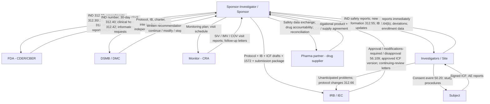

# Inter-Entity Document Flow Map

> [!authority] Governing authority
> 21 CFR 312.30-312.33 (amendments, safety, annual reports), 312.50-312.59 (sponsor duties), 312.60-312.66 (investigator duties), 21 CFR 56.108-56.109 (IRB reporting/review), ICH E6(R3) essential records; FDA DMC guidance (2006; March 2024 draft). Status: **Mixed** — each arrow is a confirmed obligation; the consolidated map and its use as an automation target are OSSICRO synthesis.

Every document in a trial has an origin, one or more mandatory destinations, a trigger, and often a clock. This page is the canonical consolidated map of those arrows for a sponsor-investigator IND study (Mode B); the [[two-modes-site-vs-sponsor-investigator|Mode A]] variant replaces "sponsor-investigator" with the pharma sponsor on the sponsor side of each arrow. The [[generate-check-validate-engine]] and [[communication-hub]] implement this map; the [[completeness-ledger]] tracks whether every mandatory arrow has fired.

## The map

## Startup arrows

| # | Artifact | From → To | Trigger / clock | Authority |
|---|---|---|---|---|
| S1 | [[ind-application-312-23|IND application]] (Form 1571 cover) | Sponsor(-investigator) → FDA | Before any human dosing; 30-day safe-to-proceed clock starts on FDA receipt | 21 CFR 312.20, 312.23, 312.40(b) |
| S2 | [[clinical-protocol-and-synopsis|Protocol]] + [[investigators-brochure|IB]] | Sponsor → each investigator, IRB, DMC | Before site participation; IB before investigation begins | 21 CFR 312.55(a); 312.53(c) |
| S3 | [[form-fda-1572-statement-of-investigator|Form FDA 1572]], CV, licenses | Investigator → sponsor | Before investigator may begin; retained by sponsor (not filed to FDA) | 21 CFR 312.53(c) |
| S4 | [[form-fda-3454-3455-financial-disclosure|Financial disclosure information]] | Investigator → sponsor | Before participation; update duty for 1 year post-completion | 21 CFR 312.53(c)(4); Part 54 |
| S5 | [[irb-submission-package|IRB submission package]] (protocol, ICF, IB, recruitment materials) | Sponsor/site → IRB | Before enrollment; see [[irb-review-workflow]] | 21 CFR 56.103; 312.66 |
| S6 | IRB approval letter + stamped/approved ICF version | IRB → sponsor/site → TMF/ISF | **Gates enrollment**; no subject involvement before approval | 21 CFR 56.103(a); 56.109(e) |
| S7 | [[dsmb-charter|DMC charter]] (where a DMC is used) | Sponsor ↔ DMC | Adopted at the organizational meeting, pre-enrollment | FDA 2006 DMC guidance; 2024 draft |
| S8 | Investigational product + shipment records | Sponsor/[[pharma-partner-sponsor|pharma supplier]] → site | Only to participating investigators, only after IND in effect and 1572 obtained | 21 CFR 312.53(b); 312.57(b) |
| S9 | [[clinical-trial-agreement-and-budget|CTA]] / IIS support agreement / [[transfer-of-regulatory-obligations-toro|TORO]] | Sponsor ↔ pharma ↔ micro-CRO | Executed before activation; each transferred obligation named in writing | 21 CFR 312.52(a) |

## Conduct arrows

| # | Artifact | From → To | Trigger / clock | Authority |
|---|---|---|---|---|
| C1 | [[enrollment-and-consent|Signed ICF]] (current IRB-approved version) | Subject → investigator → ISF; copy to subject | At the consent event, before any study procedure | 21 CFR 50.20, 50.27; [[informed-consent-document-vs-event]] |
| C2 | Monitoring visit reports (SIV/IMV/COV) | [[clinical-monitor-cra|Monitor]] → sponsor → TMF | Per [[monitoring-plan]]; each visit produces a filed report | 21 CFR 312.50, 312.56(a); ICH E6(R3); [[monitoring-workflow-siv-imv-cov]] |
| C3 | Protocol deviations | Site → sponsor; significant deviations → IRB per IRB policy | Per protocol/monitoring plan | 21 CFR 312.56(b); 312.66 |
| C4 | Protocol amendment | Sponsor → FDA (312.30) **and** → IRB (approval required before implementation, except immediate-hazard) | Change may proceed only after FDA submission + IRB approval | 21 CFR 312.30(b); 56.108(a)(4); [[annual-reporting-and-amendments]] |
| C5 | Drug accountability records | Site ↔ sponsor | Continuous; receipt/dispensing/return logged | 21 CFR 312.57(b), 312.62(a); [[drug-accountability-log]] |

## Safety arrows (the densest cluster)

| # | Artifact | From → To | Trigger / clock | Authority |
|---|---|---|---|---|
| F1 | SAE report | Investigator → sponsor | **Immediately** upon the investigator's awareness | 21 CFR 312.64(b) |
| F2 | [[ind-safety-report|IND safety report]] (SUSAR) | Sponsor → FDA **and all participating investigators** | ≤ 15 calendar days after sponsor determines it qualifies | 21 CFR 312.32(c)(1); [[form-fda-3500a-medwatch|Form 3500A]] or narrative |
| F3 | Fatal/life-threatening unexpected suspected adverse reaction | Sponsor → FDA | ≤ 7 calendar days after initial receipt; complete follow-up within 15 | 21 CFR 312.32(c)(2), (d) |
| F4 | Unanticipated problem report | Investigator → IRB | Promptly, per IRB written procedures | 21 CFR 312.66; 56.108(b)(1) |
| F5 | Relevant safety information | Sponsor → DMC (via independent statistician for unblinded data) | Per charter cadence | FDA 2006/2024 DMC guidance; [[dsmb-workflow]] |
| F6 | DMC recommendation (continue/modify/stop) | DMC → sponsor; if risk profile changes → IRB notification + protocol/ICF amendment | Written, after each closed session | FDA 2006/2024 DMC guidance |
| F7 | Safety data exchange | Sponsor-investigator ↔ pharma supplier | Per safety data exchange agreement (IIS/expanded access) | Contractual; supports the supplier's own reporting duties |
| F8 | IRB report of unanticipated problems, serious/continuing noncompliance, suspension/termination | IRB → institution, FDA (and OHRP where applicable) | Prompt | 21 CFR 56.108(b); 56.113 |

## Periodic and closeout arrows

| # | Artifact | From → To | Trigger / clock | Authority |
|---|---|---|---|---|
| P1 | [[ind-annual-report-dsur|IND annual report / DSUR]] | Sponsor → FDA | Within 60 days of IND anniversary | 21 CFR 312.33; ICH E2F |
| P2 | Continuing-review package | Site/sponsor → IRB | Per IRB-set interval, ≥ annually (FDA-regulated) | 21 CFR 56.109(f); [[irb-review-workflow]] |
| P3 | Final monitoring visit (COV) report; drug reconciliation/return/destruction | Monitor/site → sponsor → TMF | At completion/termination; unused supplies returned or disposition documented | 21 CFR 312.59, 312.62(a); [[closeout]] |
| P4 | Final report to IRB (study closure) | Investigator → IRB | At completion | 21 CFR 56.108-56.109 (IRB procedures); ICH E6(R3) |
| P5 | IND withdrawal (312.38) / inactivation (312.45); [[clinical-study-report|CSR]] | Sponsor → FDA | At program end | 21 CFR 312.38, 312.45; ICH E3 |
| P6 | Results registration | Responsible party → ClinicalTrials.gov | Per FDAAA 801 timelines | 42 CFR Part 11; [[clinicaltrials-gov-registration]] |

> [!warning] Non-delegable
> Three classes of arrow may never fire autonomously: (1) any **submission to FDA** (IND, amendment, safety report, annual report) is released only on a qualified human's explicit authorization; (2) the **causality/expectedness determination** that starts the F2/F3 clocks is the sponsor's (medical monitor's) judgment — 21 CFR 312.32(a)-(c); software may compute a deadline from a human determination, never make the determination ([[safety-clock-engine]]); (3) the **enrollment gate** (S6 + C1) opens only on a documented IRB approval and a human consent event.

> [!interpretive] OSSICRO position
> OSSICRO's coordination value is exactly this map: for every arrow, the engine knows the artifact, the destination set, the trigger, the clock, and the completeness criteria, and it drafts the artifact, routes it, and escalates on clock risk. What it never supplies is the judgment at the tail of any arrow. This consolidated map is OSSICRO synthesis; each individual arrow is independently confirmed by the cited authority.

## Related

- [[safety-reporting-workflow]] — the F-arrows in operational detail
- [[irb-review-workflow]] — the S5/S6/P2 arrows in operational detail
- [[dsmb-workflow]] — the F5/F6 arrows in operational detail
- [[monitoring-workflow-siv-imv-cov]] — the C2 arrows in operational detail
- [[document-catalog]] — the record-by-record catalog behind every artifact named here
- [[communication-hub]] · [[safety-clock-engine]] · [[completeness-ledger]] — the system components that implement this map
- [[entity-map]] — who signs, who judges, who is enforceable

## Sources

- [21 CFR 312.32 — IND safety reporting (eCFR)](https://www.ecfr.gov/current/title-21/chapter-I/subchapter-D/part-312/subpart-B/section-312.32)
- [21 CFR 312.33 — Annual reports (Cornell LII)](https://www.law.cornell.edu/cfr/text/21/312.33)
- [21 CFR 312.30 — Protocol amendments (Cornell LII)](https://www.law.cornell.edu/cfr/text/21/312.30)
- [21 CFR 312.50-312.59 — Sponsor responsibilities (eCFR, Subpart D)](https://www.ecfr.gov/current/title-21/chapter-I/subchapter-D/part-312/subpart-D)
- [21 CFR 312.64 — Investigator reports (Cornell LII)](https://www.law.cornell.edu/cfr/text/21/312.64)
- [21 CFR 56.108 — IRB functions and operations (Cornell LII)](https://www.law.cornell.edu/cfr/text/21/56.108)
- [ICH E6(R3) Step 4 Final Guideline (PDF)](https://database.ich.org/sites/default/files/ICH_E6%28R3%29_Step4_FinalGuideline_2025_0106.pdf)
- [FDA — Use of Data Monitoring Committees in Clinical Trials (guidance page)](https://www.fda.gov/regulatory-information/search-fda-guidance-documents/use-data-monitoring-committees-clinical-trials)
- [FDA — IND Application Reporting: IND Safety Reports](https://www.fda.gov/drugs/investigational-new-drug-ind-application/ind-application-reporting-ind-safety-reports)
